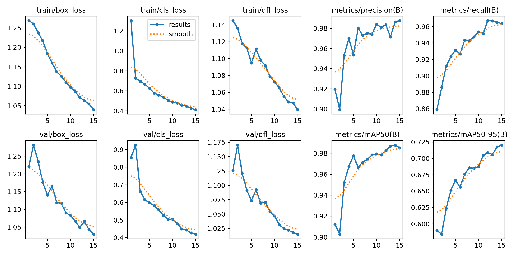

# Train and Deploy YOLO Models with Ultralytics to detect license plate
## 🎥 YOLOv8 Vehicle Detection Demo


## Train YOLO Models With Google Colab

Click below to acces a Colab notebook for training YOLO models. It makes training a custom YOLO model as easy as uploading an image dataset and running a few blocks of code.

<a href="https://colab.research.google.com/github/ruanwensheng/License-Plate-Detection-Using-YOLOv11-/blob/main/License_Plate_Detection.ipynb" target="_parent"></a>
## Results


---

### Evaluations

| Criteria                     | Evaluation |
|-----------------------------|------------|
| **Training Trend**          | Stable and steadily decreasing across all losses. No major spikes or noise. |
| **Overfitting**             | Not observed. Validation loss closely follows training loss. |
| **Localization Accuracy**   | High: **mAP50 ≈ 98.5%** |
| **General Detection Quality** | Good: **mAP50-95 ≈ 72.5%**, still improvable for harder cases |
| **Precision**               | Increases consistently, reaching ~98.5% |
| **Recall**                  | Also increases well, reaching ~96.5% |
| **Fit for LPR Task**        | Suitable – detects license plates consistently and accurately |

---
| Value               | Meaning                                                                 |
|---------------------|-------------------------------------------------------------------------|
| **181 layers**       | The model has 181 layers (e.g., Conv, BatchNorm, Upsample, etc.)        |
| **9,428,179 parameters** | Total number of learnable parameters (weights + biases)                |
| **0 gradients**       | The model is in inference mode (not training), so no gradients are calculated |
| **21.5 GFLOPs**       | Approximate computational cost per image — lower means faster inference |


## Deploy YOLO Models
The `yolo_detect.py` script provides a basic example that shows how to load a model, run inference on an image source, parse the inference results, and display boxes around each detected class in the image. This script shows how to work with YOLO models in Python, and it can be used as a starting point for more advanced applications. 

To run inference with a yolov8s model on a USB camera at 1280x720 resolution, issue:

```
python yolo_detect.py --model yolov8s.pt --source usb0 --resolution 1280x720
```

Here are all the arguments for yolo_detect.py:

- `--model`: Path to a model file (e.g. `my_model.pt`). If the model isn't found, it will default to using `yolov8s.pt`.
- `--source`: Source to run inference on. The options are:
    - Image file (example: `test.jpg`)
    - Folder of images (example: `my_images/test`)
    - Video file (example: `testvid.mp4`)
    - Index of a connected USB camera (example: `usb0`)
    - Index of a connected Picamera module for Raspberry Pi (example: `picamera0`)
- `--thresh` (optional): Minimum confidence threshold for displaying detected objects. Default value is 0.5 (example: `0.4`)
- `--resolution` (optional): Resolution in WxH to display inference results at. If not specified, the program will match the source resolution. (example: `1280x720`)
- `--record` (optional): Record a video of the results and save it as `demo1.avi`. (If using this option, the `--resolution` argument must also be specified.)


### Deploy on Raspberry Pi
The Raspberry Pi 4 and 5 are just powerful enough to run nano and small-sized YOLO models in real time. The article linked below walks through how to run YOLO models on the Raspberry Pi.

[How to Run YOLO Detection Models on the Raspberry Pi](https://www.ejtech.io/learn/yolo-on-raspberry-pi)

# Plate's Digits Recognition Using Convolutional Neural Network
## Characters Segmentation Algorithm


Connected Components Analysis (CCA) is a technique used to detect and label groups of connected pixels in a binary (black-and-white) image. It is commonly used to segment characters by identifying distinct regions where pixels are connected.

In this approach, the image is scanned to locate connected black pixels. There are two types of connectivity:
- **4-connected**: Pixels are connected horizontally and vertically.
- **8-connected**: Pixels are connected horizontally, vertically, and diagonally.

This project uses **8-connected** labeling to better capture diagonally connected pixels. Each connected region is assigned a unique label, which allows individual characters to be separated from each other and the background.

After labeling, the next step is to filter out non-character regions (e.g., noise or background blobs). This is done by analyzing each component's properties, such as:
- Size
- Width-to-height ratio
- Area
- Solidity (how solid or filled the region is)

By applying rules based on these features, we can remove regions that are too small, too large, or unlikely to represent characters.

The table below summarizes the key features used:

| Feature       | Description                                 | Purpose                         |
|---------------|---------------------------------------------|----------------------------------|
| `aspectRatio` | Width-to-height ratio of the bounding box   | Identifies tall or narrow shapes |
| `solidity`    | Contour area divided by bounding box area   | Filters out hollow or noisy blobs|
| `heightRatio` | Contour height relative to image height     | Used for size-based filtering    |
